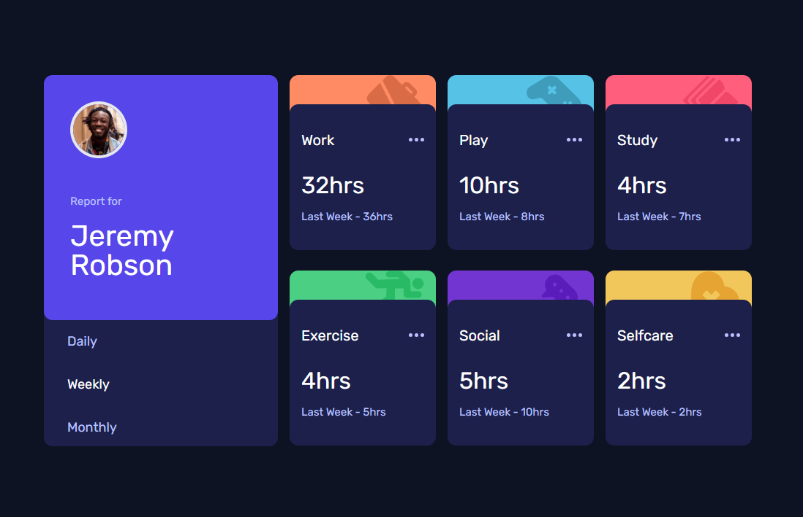

# Frontend Mentor - Time tracking dashboard

This is a solution to the
[Time tracking dashboard challenge on Frontend Mentor](https://www.frontendmentor.io/challenges/time-tracking-dashboard-UIQ7167Jw).
Frontend Mentor challenges help you improve your coding skills by
building realistic projects.

## Table of contents

- [Frontend Mentor - Time tracking dashboard](#frontend-mentor---time-tracking-dashboard)
  - [Table of contents](#table-of-contents)
  - [Overview](#overview)
    - [Screenshot](#screenshot)
    - [Links](#links)
  - [My process](#my-process)
    - [Built with](#built-with)

## Overview

### Screenshot

### Links

- Solution URL:
  [https://github.com/mehdias63/time-tracking-dashboard2]
- Live Site URL: [https://time-tracking-dashboard2-seven.vercel.app/]

## My process

### Built with

- [React](https://reactjs.org/) - JS library
- [Tailwind](https://tailwindcss.com/) - For styles
